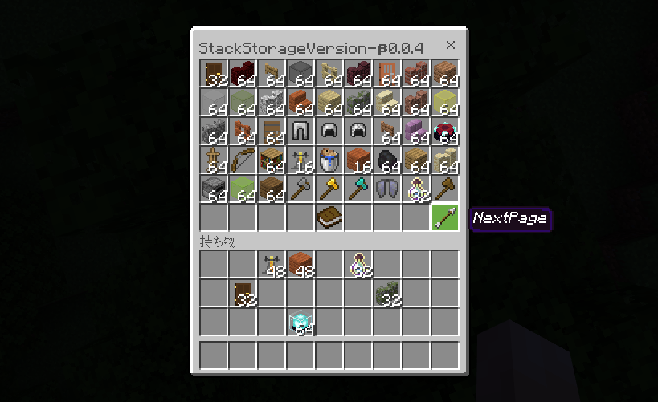
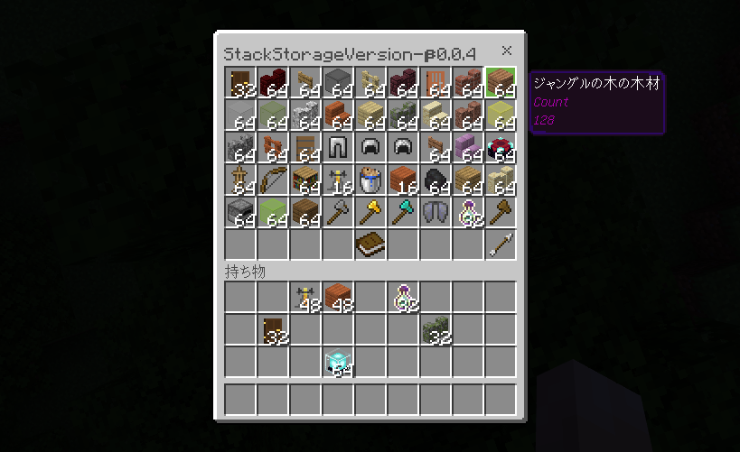

# StackStorage [](https://poggit.pmmp.io/p/StackStorage)

Add simple virtual storage  
Mysql Version

# Setup

## Config

### sql.yaml

```yml
database:
  # mysql or sqlite
  type: mysql

    # Edit these settings only if you choose "sqlite".
  sqlite:
    # The file name of the database in the plugin data folder.
  # You can also put an absolute path here.
    file: data.sqlite
  # Edit these settings only if you choose "mysql".
  mysql:
    host: 127.0.0.1
    # Avoid using the "root" user for security reasons.
    username: StackStorage
    password: password
    # Database name
    schema: StackStorage
  # The maximum number of simultaneous SQL queries
  # Recommended: 1 for sqlite, 2 for MySQL. You may want to further increase this value if your MySQL connection is very slow.
  worker-limit: 2
```

### Mysql Setup

```mysql
CREATE DATABASE StackStorage;
CREATE USER StackStorage IDENTIFIED BY 'password';
GRANT ALL on StackStorage.* to StackStorage;
```

# How to use

You can open the storage at / stackstorage or / st

# Admin

/stackstorage [xuid]

# Feature

Use the familiar chest gui that opens the most while playing with Minecraft to get items in and out infinitely
Enchantments and durability can also be saved


If you put more than 64 pieces of one item, only 64 pieces will be displayed in the storage, but the amount currently stored in the storage is written in the item description field.
The description field will be automatically deleted when the player puts it in the inventory, so it will not interfere


# Permission
`stackstorage.command.my`  
Permission to open my storage by command  
Default can be used by anyone

`stackstorage.command.user`  
Permission to open all user storage by command  
Default can be used by op

# Download

https://poggit.pmmp.io/p/StackStorage

# Note

- Data of versions below 0.1.0 cannot be inherited
